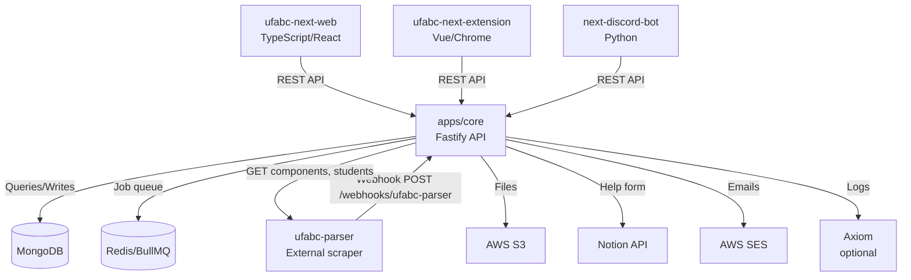
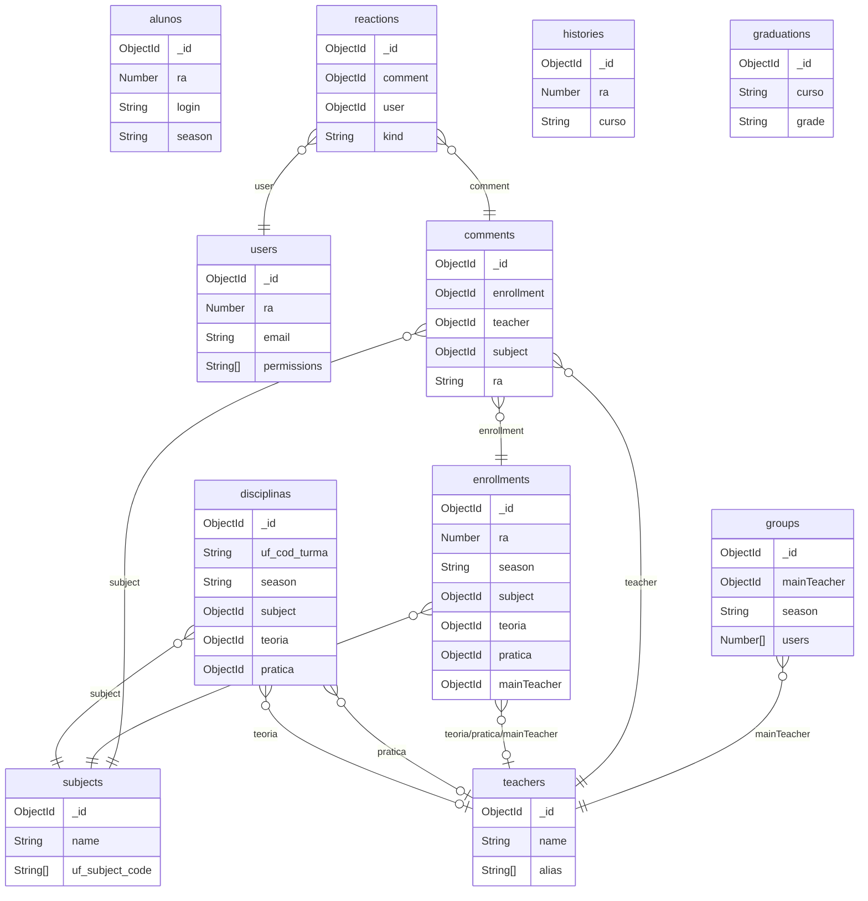
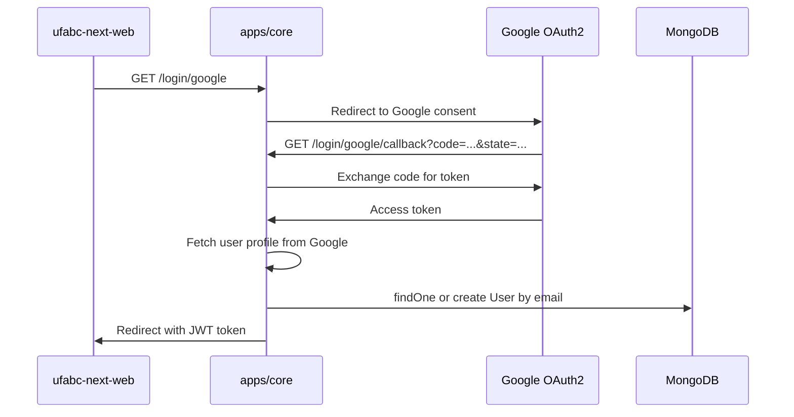
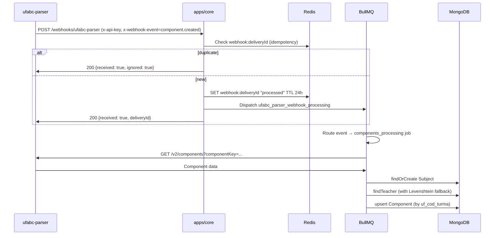
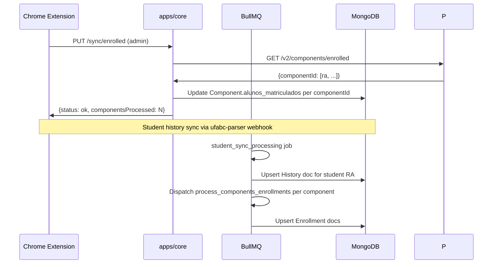
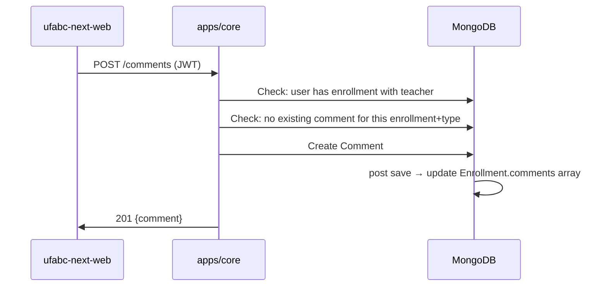

# ufabc-next-backend — Documentation

## 1. System Overview

### What this repo does and why it exists

`ufabc-next-backend` is the authoritative backend monorepo for the UFABC Next platform. It exposes a REST API consumed by the web frontend, browser extension, and Discord bot. It also processes asynchronous jobs triggered by webhooks from the external `ufabc-parser` service, which scrapes UFABC's academic systems.

**Who uses it:**
- `ufabc-next-web` — primary consumer of authenticated API endpoints
- `ufabc-next-extension` — syncs student enrollment/history data
- `next-discord-bot` — queries public stats
- `ufabc-parser` (external, closed source) — sends webhooks for component and student events

**Where it fits:**
This is the central data store and business-logic layer. All UFABC academic data (subjects, components, enrollments, teachers, histories) flows through this service.

### Tech stack

| Layer | Technology | Version |
|---|---|---|
| Language | TypeScript | ^5.x |
| Runtime | Node.js | ^24 |
| Framework | Fastify | ^5.x |
| Package manager | pnpm | ^9 (9.15.9) |
| Monorepo build | Turborepo | catalog |
| Database | MongoDB | via Docker (`mongo:latest`) |
| ODM | Mongoose | ^8.x |
| Queue | BullMQ | ^5.x |
| Queue broker | Redis | via Docker (`redis:latest`) |
| Validation | Zod + fastify-zod-openapi | — |
| Auth | Google OAuth2 + JWT (`@fastify/jwt`) | — |
| AWS SDK | `@aws-sdk/*` v3 | — |
| AWS local dev | LocalStack | `localstack/localstack:latest` |
| Logging/tracing | Axiom (optional) | — |
| Lint | oxlint + ultracite | ^1.37 / ^7.0 |
| Tests | Vitest + Testcontainers | — |

---

## 2. Architecture

### Folder structure

```
ufabc-next-backend/
├── apps/
│   └── core/                        # Main Fastify API application
│       ├── src/
│       │   ├── app.ts               # App factory: registers plugins, routes, jobs
│       │   ├── server.ts            # HTTP server entry point
│       │   ├── constants.ts         # JOB_NAMES, webhook event names, constants
│       │   ├── connectors/          # HTTP clients to external services
│       │   │   ├── ufabc-parser.ts  # Client for ufabc-parser scraper service
│       │   │   ├── moodle.ts        # Moodle integration
│       │   │   ├── sigaa.ts         # SIGAA integration
│       │   │   ├── ufabc-matricula.ts # Matricula system connector
│       │   │   ├── ai-proxy.ts      # AI proxy connector
│       │   │   ├── s3-connector.ts  # S3 file operations
│       │   │   └── base-requester.ts # Base HTTP client class
│       │   ├── controllers/         # v2 route controllers (registered before autoload)
│       │   │   ├── backoffice-controller.ts     # Redis key management
│       │   │   ├── components-controller.ts     # Component CRUD
│       │   │   ├── students-controller.ts       # Student operations
│       │   │   └── ufabc-parser-webhook-controller.ts # Incoming webhook handler
│       │   ├── errors/              # Typed error classes
│       │   ├── hooks/               # Fastify request lifecycle hooks
│       │   │   ├── jwt-verify.ts    # JWT authentication hook
│       │   │   ├── admin.ts         # Admin permission check
│       │   │   ├── board-authenticate.ts  # Bull Board auth
│       │   │   ├── matricula-session.ts   # Matricula session injection
│       │   │   ├── moodle-session.ts      # Moodle session injection
│       │   │   ├── sigaa-session.ts       # SIGAA session injection
│       │   │   └── ufabc-parser-webhook-auth.ts # Webhook HMAC validation
│       │   ├── jobs/                # BullMQ job definitions (v2, typed via @next/queues)
│       │   │   ├── registry.ts      # Maps JOB_NAMES → job definitions
│       │   │   ├── components-processing.ts     # Upsert component from webhook
│       │   │   ├── components-archive-processing-flow.ts # Archive PDF pipeline
│       │   │   ├── enrollments-processing.ts    # Upsert student enrollment
│       │   │   ├── enrolled-students.ts         # Fetch + dispatch enrolled students
│       │   │   ├── student-sync-processing.ts   # Sync student academic history
│       │   │   ├── teacher-created.ts           # Handle new teacher event
│       │   │   ├── ufabc-parser-webhook-processing.ts # Route webhook to sub-job
│       │   │   └── utils/subject-resolution.ts  # Find-or-create subject logic
│       │   ├── lib/                 # Service wrappers (AWS, Notion)
│       │   ├── models/              # Mongoose models (see Data Layer section)
│       │   ├── plugins/
│       │   │   ├── external/        # Third-party Fastify plugins (autoloaded)
│       │   │   │   ├── config.ts    # Env var schema + fastify-env
│       │   │   │   ├── jwt.ts       # @fastify/jwt setup
│       │   │   │   ├── oauth2.ts    # @fastify/oauth2 Google setup
│       │   │   │   ├── mongoose.ts  # (legacy) mongoose plugin
│       │   │   │   ├── cors.ts, cookie.ts, multipart.ts, rate-limit.ts, sensible.ts
│       │   │   │   ├── swagger.ts   # OpenAPI docs
│       │   │   │   └── zod-openapi.ts # Zod schema integration
│       │   │   ├── custom/          # App-specific plugins (autoloaded)
│       │   │   │   ├── authorization.ts  # isAdmin() request decorator
│       │   │   │   ├── memory-cache.ts   # In-memory LRU cache decorator
│       │   │   │   ├── queue.ts          # Legacy BullMQ Worker setup
│       │   │   │   ├── token-generator.ts # JWT token helper
│       │   │   │   └── tracing.ts        # Request tracing
│       │   │   └── v2/              # New queue/infra plugins
│       │   │       ├── aws.ts       # AWS SDK setup
│       │   │       ├── queue.ts     # @next/queues manager integration
│       │   │       ├── redis.ts     # Redis client plugin
│       │   │       ├── setup.ts     # Registers v2 controllers
│       │   │       └── test-utils.ts # Test helpers plugin
│       │   ├── queue/               # Legacy BullMQ definitions
│       │   │   ├── definitions.ts   # JOBS and QUEUE_JOBS map
│       │   │   ├── Job.ts, Worker.ts, board.ts # Legacy queue primitives
│       │   │   └── jobs/            # Legacy job handlers (email, logs, notion, enrollments)
│       │   ├── routes/              # Auto-loaded Fastify routes
│       │   │   ├── autohooks.ts     # Global route hooks (JWT verification)
│       │   │   ├── backoffice/      # POST /token, GET/DELETE /jobs/failed, etc.
│       │   │   ├── comments/        # Comment + Reaction CRUD
│       │   │   ├── courseStats/     # Grade distribution, user history
│       │   │   ├── entities/
│       │   │   │   ├── components/  # List components, kicked list
│       │   │   │   ├── enrollments/ # User enrollments
│       │   │   │   ├── students/    # Student info + stats
│       │   │   │   ├── subjects/    # List + search subjects
│       │   │   │   └── teachers/    # Teacher CRUD + reviews
│       │   │   ├── graduations/     # Graduation subjects (admin)
│       │   │   ├── help/            # Help form → Notion
│       │   │   ├── histories/       # Courses list by season
│       │   │   ├── login/           # Google OAuth2 flow
│       │   │   ├── public/          # Unauthenticated stats
│       │   │   ├── sync/            # Admin: sync enrolled students
│       │   │   └── users/           # User profile, confirm, devices
│       │   ├── schemas/             # Zod request/response schemas
│       │   ├── services/            # Business logic services
│       │   └── utils/               # Utilities (logger, AWS client options, stats)
│       ├── tests/
│       │   └── integration/         # Vitest + Testcontainers integration tests
│       ├── .env.example
│       ├── package.json
│       └── vitest.config.ts
├── packages/
│   ├── common/                      # Shared utility functions (calculateCoefficients, findQuad, identifier)
│   ├── db/                          # Shared Mongoose client + models (HistoryProcessingJob, StudentSync)
│   ├── queues/                      # @next/queues — typed BullMQ JobBuilder abstraction
│   ├── testing/                     # Shared test utilities (factories, containers, mocks)
│   └── tsconfig/                    # Shared TypeScript configs
├── scripts/
│   └── docker/mongo/initdb.d/       # MongoDB initialization scripts (indexes, seed data)
├── docker-compose.yml               # Local dev: MongoDB, Redis, LocalStack
├── Dockerfile                       # Multi-stage build with git-secret for .env decryption
├── turbo.json
└── pnpm-workspace.yaml
```

### Layer responsibilities

1. **External plugins** — loaded first via `@fastify/autoload`; set up env config, CORS, JWT, OAuth2, rate limiting, Swagger
2. **Custom plugins** — loaded second; add decorators (cache, isAdmin, token generation, tracing)
3. **v2 plugins** — Redis, AWS, queue manager
4. **v2 controllers** — registered before autoload; components, backoffice, students, webhook receiver
5. **Route autoload** — `routes/` directory with cascading autohooks (JWT auth by default)

### Plugin registration order

```
external plugins → custom plugins → redis v2 → db → queue v2 → aws v2 → autoloaded routes → test-utils
```

### Auth strategy

- **Primary**: JWT bearer token (`Authorization: Bearer <token>`)  
  - Issued after Google OAuth2 callback  
  - Payload: `{ _id, ra, confirmed, email, permissions }`  
  - Default expiry: session-length; backoffice tokens: 2h  
- **Admin**: `request.isAdmin(reply)` checks `user.permissions` array  
- **Webhook**: `x-api-key` header validated by `ufabc-parser-webhook-auth` hook  
- **Board (Bull Board)**: `authenticateBoard` hook using `BOARD_PATH` env

### System context diagram



---

## 3. Data Layer

### MongoDB collections

#### `alunos` (Student)

Student snapshot per academic season.

| Field | Type | Required | Notes |
|---|---|---|---|
| `ra` | Number | yes | UFABC student registration number |
| `login` | String | yes | UFABC login (e.g. `nome.sobrenome`) |
| `aluno_id` | Number | no | UFABC internal student ID |
| `cursos` | CourseArray | no | Array of enrolled degree programs |
| `cursos[].id_curso` | Number | no | Course ID |
| `cursos[].nome_curso` | String | yes | Course name |
| `cursos[].cp` | Number | no | Cumulative performance coefficient |
| `cursos[].cr` | Number | no | Cumulative grade coefficient |
| `cursos[].ca` | Number | no | Cumulative achievement coefficient |
| `cursos[].ind_afinidade` | Number | yes | Course affinity index |
| `cursos[].turno` | Enum | yes | `Noturno\|Matutino\|noturno\|matutino\|n\|m` |
| `cursos[].creditos_*` | Number | no | Obtained/mandatory/optional/free credits |
| `year` | Number | no | Academic year |
| `quad` | Number (1-3) | no | Academic quadrimester |
| `quads` | Number | no | Total quadrimesters enrolled |
| `season` | String | yes | Composite key, e.g. `"2024:1"` |

#### `disciplinas` (Component)

An offering of a subject in a specific season/class.

| Field | Type | Required | Notes |
|---|---|---|---|
| `disciplina_id` | Number | no | Legacy UFABC numeric ID |
| `disciplina` | String | yes | Subject display name |
| `turno` | Enum | yes | `diurno\|noturno` |
| `turma` | String | yes | Class code (e.g. `"NA1"`) |
| `vagas` | Number | yes | Total seats |
| `obrigatorias` | [Number] | no | Course IDs where mandatory |
| `codigo` | String | yes | Subject code (e.g. `"MCTA001-13"`) |
| `campus` | Enum | yes | `sao bernardo\|santo andre\|sbc\|sa` |
| `ideal_quad` | Boolean | yes | Whether ideal quadrimester |
| `uf_cod_turma` | String | yes | UFABC classroom code (unique key) |
| `tpi` | [Number, Number, Number] | yes | Theory/Practice/Individual hours |
| `identifier` | String | no | Composite unique key |
| `alunos_matriculados` | [Number] | yes | Currently enrolled student RAs |
| `before_kick` | [Number] | yes | Enrollment snapshot before semester cutoff |
| `after_kick` | [Number] | yes | Enrollment snapshot after semester cutoff |
| `year` | Number | yes | Academic year |
| `quad` | Number | yes | Quadrimester |
| `season` | String | yes | `"year:quad"` |
| `subject` | ObjectId → subjects | yes | Subject reference |
| `teoria` | ObjectId → teachers | no | Theory teacher |
| `pratica` | ObjectId → teachers | no | Practice teacher |
| `groupURL` | String | no | WhatsApp/group URL |
| `kind` | Enum | yes | `api\|file` — data source |
| `priorityOnCreateGroup` | Boolean | no | Priority in group creation |

**Indexes**: `identifier asc`

#### `enrollments` (Enrollment)

Per-student record for each component attended.

| Field | Type | Notes |
|---|---|---|
| `year`, `quad` | Number | Academic period |
| `identifier` | String | Composite key |
| `ra` | Number | Student RA |
| `disciplina` | String | Subject name |
| `subject` | ObjectId → subjects | |
| `campus`, `turno`, `turma` | String | Class location/shift |
| `teoria`, `pratica` | ObjectId → teachers | |
| `mainTeacher` | ObjectId → teachers | Set by pre-hook: theory ?? practice |
| `comments` | [Enum] | Which comment types exist: `teoria\|pratica` |
| `syncedBy` | Enum | `extension\|matricula\|ufabc-parser` |
| `kind` | Enum | `ajuste\|reajuste\|auto` |
| `uf_cod_turma` | String | UFABC classroom code |
| `conceito` | String | Final grade (A/B/C/D/O/F/-) |
| `creditos` | Number | Credits |
| `ca_acumulado`, `cr_acumulado`, `cp_acumulado` | Number | Accumulated coefficients |
| `season` | String | `"year:quad"` |
| `disciplina_id` | Number | Legacy ID |

**Indexes**: `(identifier, ra)`, `ra`, `conceito`, `(mainTeacher, subject, cr_acumulado, conceito)`

**Hooks**:
- `pre findOneAndUpdate`: sets `mainTeacher = teoria ?? pratica`
- `post findOneAndUpdate`: adds student RA to matching Group

#### `subjects` (Subject)

Canonical academic subjects (deduplicated across seasons).

| Field | Type | Notes |
|---|---|---|
| `name` | String | Subject name |
| `search` | String (text index) | Normalized search string (startCase camelCase of name) |
| `uf_subject_code` | [String] | UFABC subject codes (unique sparse index) |
| `creditos` | Number | Credit hours |

**Hooks**: `pre save` normalizes `search` field.

#### `teachers` (Teacher)

| Field | Type | Notes |
|---|---|---|
| `name` | String | Lowercase normalized |
| `alias` | [String] | Known alternative spellings |
| `siape` | String | Government teacher ID (sparse unique) |
| `externalKey` | String | External key (sparse unique) |

**Indexes**: text index on `(name, alias)` with weights 10/5; `siape` unique sparse; `externalKey` unique sparse.

**Hooks**: `pre save` lowercases name. Levenshtein fuzzy matching available via `findBestLevenshteinMatch()`.

#### `users` (User)

Platform user account.

| Field | Type | Notes |
|---|---|---|
| `ra` | Number | Unique sparse (partial filter) |
| `email` | String | Must contain `ufabc.edu.br`; unique sparse |
| `confirmed` | Boolean | Email confirmed |
| `expiresAt` | Date | TTL index: auto-deletes unconfirmed accounts |
| `active` | Boolean | Account status |
| `oauth.google`, `oauth.email`, etc. | String | OAuth provider data |
| `devices` | [{phone, token, deviceId}] | Push notification devices |
| `permissions` | [String] | e.g. `["admin"]` |

#### `comments` (Comment)

Student comment on a teacher for a specific enrollment.

| Field | Type | Notes |
|---|---|---|
| `comment` | String | Comment text |
| `viewers` | Number | View count (incremented on find) |
| `enrollment` | ObjectId → enrollments | |
| `type` | Enum | `teoria\|pratica` |
| `ra` | String | Author RA |
| `active` | Boolean | Soft delete |
| `teacher` | ObjectId → teachers | |
| `subject` | ObjectId → subjects | |
| `reactionsCount.{like,recommendation,star}` | Number | Cached counts |

**Hooks**: `pre save` prevents duplicate comments per enrollment+type. `post save` adds comment type to enrollment. `post find` increments viewer count.

#### `reactions` (Reaction)

Like/recommendation/star on a comment.

| Field | Type | Notes |
|---|---|---|
| `kind` | Enum | `like\|recommendation\|star` |
| `comment` | ObjectId → comments | |
| `user` | ObjectId → users | |
| `active` | Boolean | |
| `slug` | String | `"kind:commentId:userId"` uniqueness key |

**Business rule**: `recommendation` requires the user to have had an enrollment with that teacher.

#### `groups` (Group)

Aggregates student RAs per teacher+season+disciplina (for group links).

| Field | Type | Notes |
|---|---|---|
| `disciplina` | String | |
| `season` | String | |
| `mainTeacher` | ObjectId → teachers | |
| `users` | [Number] | Student RAs |

#### `histories` (History)

Student full academic transcript.

| Field | Type | Notes |
|---|---|---|
| `ra` | Number | |
| `disciplinas` | [HistoryDisciplina] | All past courses |
| `coefficients` | HistoryCoefficients | `{year: {quad: {ca_quad, ca_acumulado, cr_quad, cr_acumulado, cp_acumulado, percentage_approved, accumulated_credits, period_credits}}}` |
| `curso` | String | Degree program |
| `grade` | String | Curriculum version |

**HistoryDisciplina fields**: `periodo`, `codigo`, `disciplina`, `ano`, `situacao`, `creditos`, `categoria`, `conceito`, `turma`, `teachers`, `disciplina_id`, `identifier`

#### `graduations` (Graduation)

Graduation plan definition.

| Field | Type | Notes |
|---|---|---|
| `locked` | Boolean | |
| `curso` | String | |
| `grade` | String | Curriculum version |
| `mandatory_credits_number`, `limited_credits_number`, `free_credits_number`, `credits_total` | Number | Credit requirements |
| `creditsBreakdown` | [{year, quad, choosableCredits}] | Per-period breakdown |

### Entity Relationship Diagram



---

## 4. API and Contracts

All routes require JWT authentication (`Authorization: Bearer <token>`) unless noted as public.

### Authentication

| Method | Path | Auth | Description |
|---|---|---|---|
| GET | `/login/google` | None | Redirect to Google OAuth2 consent screen |
| GET | `/login/google/callback` | None | OAuth2 callback; issues JWT, redirects to web |

### Public (no auth)

| Method | Path | Auth | Description |
|---|---|---|---|
| GET | `/public/summary` | None | Platform stats (teachers, subjects, students) |
| GET | `/public/graduations` | None | List graduation programs |
| GET | `/public/stats` | None | Student enrollment statistics |
| GET | `/public/components/:season` | None | Components summary for a season |
| GET | `/health` | None | Health check → `{message: "OK"}` |

### Users

| Method | Path | Auth | Description |
|---|---|---|---|
| GET | `/users/info` | JWT | Current user info |
| GET | `/users/validate/:ra` | JWT | Validate RA belongs to user |
| PUT | `/users/` | JWT | Update user profile |
| POST | `/users/confirm` | JWT | Confirm user email |
| POST | `/users/resend` | JWT | Resend confirmation email |
| POST | `/users/recovery` | JWT | Send password recovery email |
| DELETE | `/users/deactivate` | JWT | Soft-delete account |
| POST | `/users/login/facebook` | None | Legacy Facebook login |

### Entities

| Method | Path | Auth | Description |
|---|---|---|---|
| GET | `/entities/components` | JWT | List components for season (`?season=`) |
| GET | `/entities/components/kicked` | JWT | List kicked components |
| GET | `/entities/components/teacher` | JWT | Components by teacher |
| GET | `/entities/enrollments` | JWT | Current user's enrollments |
| GET | `/entities/enrollments/wpp` | JWT | Enrollments with WhatsApp group info |
| GET | `/entities/enrollments/:enrollmentId` | JWT | Single enrollment with comments |
| GET | `/entities/students` | JWT (header RA+login) | Get student by RA+login |
| GET | `/entities/students/courses` | JWT | All student courses |
| GET | `/entities/students/stats/components` | JWT | Enrollment stats per component |
| PUT | `/entities/students` | JWT | Update student data |
| GET | `/entities/subjects` | JWT | List subjects (paginated) |
| GET | `/entities/subjects/search` | JWT | Full-text search subjects (`?q=`) |
| GET | `/entities/subjects/:subjectId` | JWT | Subject reviews + distribution |
| GET | `/entities/teachers` | JWT | List all teachers |
| POST | `/entities/teachers` | JWT+Admin | Create teacher(s) |
| PUT | `/entities/teachers/:teacherId` | JWT+Admin | Update teacher aliases |
| GET | `/entities/teachers/search` | JWT | Search teachers (`?q=`) |
| GET | `/entities/teachers/:teacherId` | JWT | Teacher reviews |

### Comments & Reactions

| Method | Path | Auth | Description |
|---|---|---|---|
| GET | `/comments/:userId/missing` | JWT | Enrollments without comments |
| POST | `/comments` | JWT | Create comment |
| PUT | `/comments/:commentId` | JWT | Update comment |
| DELETE | `/comments/:commentId` | JWT | Delete comment |
| GET | `/comments/teacher/:teacherId` | JWT | Comments on a teacher |
| POST | `/comments/:commentId/reactions` | JWT | Add reaction |
| DELETE | `/comments/:commentId/reactions/:reactionId` | JWT | Remove reaction |
| GET | `/comments/reactions` | JWT | Get reactions |

### Course Stats

| Method | Path | Auth | Description |
|---|---|---|---|
| GET | `/courseStats/grades` | JWT | CR distribution across all students |
| GET | `/courseStats/history` | JWT | Current user's grade history |

### Graduations

| Method | Path | Auth | Description |
|---|---|---|---|
| GET | `/graduations/subjects` | JWT+Admin | List graduation subjects (paginated) |
| GET | `/graduations/subjects/:graduationId` | JWT+Admin | Subjects for a graduation |

### Histories

| Method | Path | Auth | Description |
|---|---|---|---|
| GET | `/histories/courses` | JWT | Distinct courses by current season |

### Help

| Method | Path | Auth | Description |
|---|---|---|---|
| POST | `/help/form` | JWT | Submit help form (multipart) → Notion |

### Sync (Admin)

| Method | Path | Auth | Description |
|---|---|---|---|
| PUT | `/sync/enrolled` | JWT+Admin | Sync enrolled students from ufabc-parser |

### Backoffice

| Method | Path | Auth | Description |
|---|---|---|---|
| POST | `/backoffice/token` | None (email check) | Generate admin JWT for email in BACKOFFICE_EMAILS |
| GET | `/backoffice/redis/keys` | JWT+Admin | List Redis keys by namespace |
| DELETE | `/backoffice/redis/key` | — | Delete a Redis key |
| GET | `/backoffice/jobs/failed` | JWT | List failed BullMQ jobs |

### v2 Controllers

| Method | Path | Auth | Description |
|---|---|---|---|
| GET | `/backoffice/redis/keys` | Admin | Redis key management |
| DELETE | `/backoffice/redis/key` | — | Delete key |

### Webhook (incoming)

| Method | Path | Auth | Description |
|---|---|---|---|
| POST | `/webhooks/ufabc-parser` | `x-api-key` header | Receive events from ufabc-parser |

**Webhook headers**:
- `x-api-key` — API key (`WEBHOOK_API_KEY`)
- `x-webhook-event` — One of: `student.synced`, `student.failed`, `component.created`, `component.updated`, `teacher.created`
- `x-webhook-delivery-id` — UUID (idempotency key, cached in Redis 24h)
- `x-webhook-timestamp` — ISO datetime

---

## 5. Background Jobs / Workers

### Architecture

Two coexisting systems:
1. **v2 jobs** — defined via `@next/queues` `defineJob()` builder; strongly typed with Zod; registered in `apps/core/src/jobs/registry.ts`; managed by `app.manager` (BullMQ queue manager)
2. **Legacy jobs** — defined in `apps/core/src/queue/definitions.ts`; managed by `app.worker` and `app.job`

### v2 Jobs

| Job name | Trigger | Input | Output | Side effects |
|---|---|---|---|---|
| `ufabc_parser_webhook_processing` | Webhook event received | `{deliveryId, event, timestamp, data}` | — | Routes to sub-jobs based on event type |
| `components_processing` | `component.created` or `component.updated` | `{deliveryId, event, timestamp, data.componentKey}` | `{componentId}` or `{component, created}` | Upserts Component doc; creates/updates Subject; links Teachers (with Levenshtein fuzzy match) |
| `teacher_created` | `teacher.created` | Teacher data | — | Upserts Teacher doc |
| `process_components_enrollments` | `student.synced` | `{ra, component[], coefficients}` | Per-item: `{success, enrollmentId}` | Upserts Enrollment doc per component; links to HistoryProcessingJob if provided |
| `student_sync_processing` | `student.synced` | Student sync data | — | Updates Student + History docs |
| `enrolled_students` | Manual/scheduled | — | — | Fetches enrolled students from ufabc-parser; dispatches `process_enrolled_students` per student |
| `process_enrolled_students` | Dispatched by `enrolled_students` | Per-student enrollment data | — | Upserts enrollment records |
| `components_archives_processing` | Archive upload | Archive metadata | — | Orchestrates PDF download + summary |
| `components_archives_processing_pdf` | Sub-job | Archive S3 key | — | Downloads PDF from S3 |
| `components_archives_processing_summary` | Sub-job | Extracted data | — | Writes summary |

**Concurrency**: `process_components_enrollments` runs 5 concurrent handlers. Default: 3 retries with exponential backoff (1s base).

### Legacy Jobs

| Job name | Queue | Trigger | Concurrency | Notes |
|---|---|---|---|---|
| `SendEmail` | `send_email` | App dispatch | 1 | Transactional email via SES |
| `SendBulkEmail` | `send_email` | App dispatch | 1 | Bulk email send |
| `UserEnrollmentsUpdate` | `user_enrollments_update` | App dispatch | 5 | Update user enrollment records |
| `ProcessComponentsEnrollments` | `user_enrollments_update` | App dispatch | 5 | Process component enrollments |
| `LogsUpload` | `logs_upload` | Every 1 day (cron) | 1 | Uploads request logs to S3 |
| `InsertNotionPage` | `notion_insert` | POST /help/form | 5 | Creates Notion page from help form |

---

## 6. Configuration

All env vars validated at startup by `apps/core/src/plugins/external/config.ts` (Zod schema). App will not start if required vars are missing.

| Variable | Required | Default | Purpose |
|---|---|---|---|
| `NODE_ENV` | no | `dev` | `dev\|test\|prod` |
| `PORT` | no | `5000` | HTTP listen port |
| `HOST` | no | `0.0.0.0` | HTTP listen host |
| `PROTOCOL` | no | `http` | `http\|https` |
| `JWT_SECRET` | no | hardcoded dev value | JWT signing secret — **change in prod** |
| `RATE_LIMIT_MAX` | no | `100` | Max requests per window |
| `MONGODB_CONNECTION_URL` | no | `mongodb://127.0.0.1:27017/ufabc-matricula` | MongoDB connection string |
| `REDIS_CONNECTION_URL` | no | `redis://localhost:6379` | Redis connection string |
| `WEB_URL` | no | `http://localhost:3000` | ufabc-next-web URL (OAuth redirect) |
| `CRONOS_URL` | no | `http://localhost:5173` | Cronos service URL |
| `ALLOWED_ORIGINS` | **yes** | — | Comma-separated CORS origins |
| `UFABC_PARSER_URL` | **yes** | — | Base URL of ufabc-parser service |
| `UFABC_PARSER_REQUESTER_KEY` | **yes** | — | Auth key for ufabc-parser API calls |
| `UFABC_PARSER_WEBHOOK_SECRET` | no | — | HMAC secret for webhook signature validation |
| `WEBHOOK_API_KEY` | no | `webhook-api-key` | Static API key for incoming webhooks |
| `AWS_REGION` | **yes** | `us-east-1` | AWS region |
| `AWS_ACCESS_KEY_ID` | **yes** | — | AWS credentials |
| `AWS_SECRET_ACCESS_KEY` | **yes** | — | AWS credentials |
| `AWS_BUCKET` | no | `ufabc-next` | S3 bucket name |
| `USE_LOCALSTACK` | no | `true` | Use LocalStack instead of real AWS |
| `LOCALSTACK_ENDPOINT` | no | `http://localhost:4566` | LocalStack gateway URL |
| `NEXT_AGENT_URL` | **yes** | — | Agent service URL |
| `SERVICE_HEADER` | no | — | Optional service identification header |
| `OAUTH_GOOGLE_CLIENT_ID` | **yes** | — | Google OAuth2 client ID |
| `OAUTH_GOOGLE_SECRET` | **yes** | — | Google OAuth2 secret (min 16 chars) |
| `BACKOFFICE_EMAILS` | no | — | Comma-separated admin emails |
| `AXIOM_TOKEN` | no | — | Axiom logging token |
| `AXIOM_DATASET` | no | — | Axiom dataset name |
| `BOARD_PATH` | no | — | Bull Board UI path |
| `NOTION_INTEGRATION_SECRET` | no | `notion_integration_secret` | Notion API secret |
| `NOTION_DATABASE_ID` | no | `notion_database_id` | Notion DB for help forms |

**To add a new env var**: add it to the `configSchema` Zod object in `config.ts`, then update `.env.example`.

---

## 7. End-to-End Data Flows

### Flow 1: Student logs in via Google OAuth2



### Flow 2: ufabc-parser sends component webhook



### Flow 3: Extension syncs student enrollment history



### Flow 4: Student submits a teacher comment



---

## 8. Technical Decisions

### Patterns and rationale

| Pattern | Location | Why |
|---|---|---|
| Fastify plugin autoload | `app.ts` | Filesystem-based route/plugin discovery; no manual import per route |
| Zod + fastify-zod-openapi | All schemas | Single source of truth for runtime validation and OpenAPI docs |
| `JobBuilder` fluent API | `@next/queues` | Type-safe job definitions with input/output schema; `.iterator()` for fan-out patterns |
| Levenshtein teacher matching | `Teacher.ts`, `components-processing.ts` | UFABC scraped data has inconsistent teacher name formatting across sources |
| Webhook idempotency via Redis | `ufabc-parser-webhook-controller.ts` | ufabc-parser may retry deliveries; 24h TTL prevents double-processing |
| `before_kick` / `after_kick` fields | `Component.ts` | Snapshot enrollment state around UFABC's enrollment cutoff ("chute") for historical analysis |
| git-secret for prod env | `Dockerfile` | Encrypted `.env.prod.secret` committed to repo; decrypted at container start using GPG key passed as build arg |
| Two queue systems (v2 + legacy) | `jobs/`, `queue/` | v2 system is the target architecture; legacy queue from `queue/definitions.ts` is being migrated |
| In-memory LRU cache | `plugins/custom/memory-cache.ts` | Per-request cache decorator for hot read paths (components list, user info) |

### Known technical debt

| Location | Issue |
|---|---|
| `apps/core/src/queue/` | Legacy queue system coexists with v2; migration incomplete |
| `// @ts-ignore` scattered in Enrollment hooks | Mongoose v8 type inference limitations with `$set` in update pipelines |
| `routes/backoffice/index.ts:44` | `// preHandler: [adminHook]` commented out on DELETE /redis/key — no auth guard |
| `routes/entities/components/index.ts` | `// @ts-ignore` on query.season |
| `apps/core/src/models/GraduationHistory.ts`, `GraduationSubject.ts` | Models exist but no route coverage visible in routes directory |
| `NEXT_AGENT_URL` env var | Referenced in config but no connector found in source |

---

## 9. Contributor Guide

### Zero-to-running locally

```bash
# Prerequisites: Node 24+, pnpm 9+, Docker

# 1. Clone
git clone https://github.com/ufabc-next/ufabc-next-backend.git
cd ufabc-next-backend

# 2. Install dependencies
pnpm install

# 3. Start infrastructure (MongoDB + Redis + LocalStack)
pnpm services:up

# 4. Create env file
cp apps/core/.env.example apps/core/.env.dev
# Fill in: UFABC_PARSER_URL, OAUTH_GOOGLE_CLIENT_ID, OAUTH_GOOGLE_SECRET,
#          UFABC_PARSER_REQUESTER_KEY, NEXT_AGENT_URL, ALLOWED_ORIGINS

# 5. Run dev server
pnpm dev

# API listens on http://localhost:5000
# Swagger UI at http://localhost:5000/docs (if configured)
```

### Run tests

```bash
# All tests (integration, needs Docker for Testcontainers)
pnpm test

# Single package
cd apps/core && pnpm test
```

Tests use Testcontainers (real MongoDB + Redis). Do not mock the database.

### Lint + type check

```bash
pnpm lint        # oxlint via ultracite
pnpm tsc         # TypeScript type checking
```

### Build

```bash
pnpm build       # Turborepo builds all packages
```

### Adding a new API endpoint

1. Create `apps/core/src/routes/<feature>/index.ts` as `FastifyPluginAsyncZodOpenApi`
2. Define Zod schemas in `apps/core/src/schemas/<feature>.ts`
3. Add service logic in `apps/core/src/routes/<feature>/service.ts`
4. Auth is handled by cascading autohooks — JWT is required by default
5. For admin-only routes add `preHandler: (req, reply) => req.isAdmin(reply)`

### Adding a new background job

1. Define in `apps/core/src/jobs/<name>.ts` using `defineJob(JOB_NAMES.NAME).input(schema).handler(async ({job, app}) => {})`
2. Add the name to `JOB_NAMES` in `constants.ts`
3. Register in `apps/core/src/jobs/registry.ts`
4. Dispatch via `app.manager.dispatch(JOB_NAMES.NAME, data)`

### Adding a new model

1. Create `apps/core/src/models/<Name>.ts` with Mongoose schema
2. Export `<Name>Model`, `type <Name>`, `type <Name>Document`
3. Add to shared `packages/db/src/models.ts` if needed across packages

---

## 10. Domain Glossary

| Term | Meaning |
|---|---|
| RA | *Registro Acadêmico* — unique student number at UFABC |
| Disciplina | Academic subject/course (e.g. "Funções de Uma Variável") |
| Componente (disciplina) | A specific offering of a subject in a season, campus, shift, and class |
| Turma | Class section code (e.g. `NA1`, `SA2`) |
| Turno | Shift: `diurno` (daytime) or `noturno` (evening) |
| Quad / Quadrimestre | UFABC's 3-period academic year (Q1, Q2, Q3) |
| Season | Composite period key: `"year:quad"` (e.g. `"2024:2"`) |
| TPI | Theory/Practice/Individual hours — credit hour breakdown |
| Campus SA | Santo André campus |
| Campus SBC | São Bernardo do Campo campus |
| Chute | UFABC's enrollment cutoff/lottery system that kicks students from oversubscribed classes |
| before_kick / after_kick | Enrollment snapshot before/after the chute |
| Conceito | Final grade: A/B/C/D/O (approved) or F (failed) |
| Situacao | Enrollment outcome: Aprovado/Reprovado/Repr.Freq/etc. |
| CR | *Coeficiente de Rendimento* — academic performance coefficient |
| CA | *Coeficiente de Aproveitamento* — credits completion coefficient |
| CP | *Coeficiente de Progressão* — progression coefficient |
| BCT | *Bacharelado em Ciência e Tecnologia* — foundational 3-year degree at UFABC |
| BCC | *Bacharelado em Ciência da Computação* — CS undergraduate degree |
| SIGAA | Academic management system used at some Brazilian universities |
| SIAPE | Federal teacher registration number |
| ufabc-parser | External service (closed-source) that scrapes UFABC's enrollment portal |
| Grade | Curriculum version (e.g. `"2017"`) — UFABC updates graduation requirements by year |
| Obrigatória / Opção Limitada / Livre Escolha | Mandatory / Limited option / Free choice credit categories |
